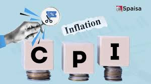

# CPI Inflation Analysis Project

---

# Project Overview

This Excel project focuses on analyzing Consumer Price Index (CPI) inflation trends to understand price changes, inflation patterns, and economic impact over time.

The project uses Excel for:
- Data cleaning
- Trend analysis
- KPI tracking
- Visualization
- Inflation insights

The analysis helps identify how inflation affects different sectors and overall economic conditions.

---

# Business Problem Statement

Inflation directly impacts:
- Consumer purchasing power
- Cost of living
- Economic growth
- Interest rates
- Business pricing strategies

The objective of this project is to analyze CPI inflation data to:
- Identify inflation trends
- Compare inflation across periods
- Detect high inflation periods
- Understand economic patterns
- Support data-driven economic decisions

---

# Dataset Information

File Used: **cpi inflation.xlsx**

### Available Sheets
- MY DATA
- Q1
- Q2
- Q3
- Q4
- Q5
- Sheet1

### Columns Present
- Sector
- Year
- Month
- Year_month
- Cereals and products
- Meat and fish
- Egg
- Milk and products
- Oils and fats
- Fruits
- Vegetables
- Pulses and products
- Sugar and Confectionery
- Spices
- Non-alcoholic beverages
- Prepared meals, scks, sweets etc.
- Food and beverages
- Pan, tobacco and intoxicants
- Clothing
- Footwear
- Clothing and footwear
- Housing
- Fuel and light
- Household goods and services
- Health
- Transport and communication
- Recreation and amusement
- Education
- Persol care and effects
- Miscellaneous
- General index
- Food & Beverages
- Clothing & Footwear
- Housing, Fuel & Utilities
- Health & Personal Care
- Miscellaneous, Recreation & Amusement
- Total CPI

---

# Exploratory Data Analysis (EDA)

## 1. Dataset Structure
- Total number of rows and columns
- Data type verification
- Missing value analysis

## 2. Inflation Trend Analysis
- CPI movement over time
- Year-wise inflation comparison
- Monthly inflation tracking

## 3. Economic Pattern Analysis
- High inflation periods
- Low inflation periods
- Average inflation rate

## 4. Statistical Analysis
- Maximum CPI value
- Minimum CPI value
- Mean and median inflation

## 5. Time-based Analysis
- Monthly trend analysis
- Quarterly inflation movement
- Annual growth analysis

---

# Key Analysis Performed

## 1. Inflation Growth Analysis
- Measured rise in CPI values over time
- Compared inflation rates across years

## 2. Trend Identification
- Identified periods of rapid inflation increase
- Analyzed economic fluctuations

## 3. Comparative Analysis
- Compared inflation across categories and timelines

## 4. Data Visualization
Created:
- Line charts
- Bar charts
- KPI cards
- Trend analysis dashboards

---

# KPIs Used

- Average CPI
- Inflation Growth Rate
- Maximum Inflation
- Minimum Inflation
- Monthly Change %
- Yearly Growth %
- Trend Indicators

---

# Excel Techniques Used

## Data Cleaning
- Removed null values
- Corrected formatting
- Standardized date columns

## Excel Functions
- SUM
- AVERAGE
- IF
- COUNT
- VLOOKUP/XLOOKUP
- Pivot Tables

## Visualization Techniques
- Line Charts
- Column Charts
- Conditional Formatting
- KPI Cards
- Slicers

---

# Key Insights

- Inflation shows fluctuations across time periods.
- Certain months/years experienced sharp CPI increases.
- Trend analysis helps identify economic instability periods.
- CPI growth impacts purchasing power and business pricing.
- Inflation forecasting supports better financial planning.

---

# Scope of Improvement

## 1. Predictive Forecasting
Use machine learning models to forecast future inflation trends.

## 2. Real-time Economic Dashboard
Connect live economic APIs for automatic CPI updates.

## 3. Regional Inflation Analysis
Compare inflation trends across regions or countries.

## 4. Advanced Visualization
Develop interactive dashboards using Power BI or Tableau.

## 5. Economic Correlation Analysis
Analyze CPI relationship with:
- GDP
- Interest Rates
- Oil Prices
- Employment Rates

---

# Tools & Technologies Used

- Microsoft Excel
- Pivot Tables
- Charts & Dashboards
- Data Cleaning Techniques

---

# Skills Demonstrated

- Data Cleaning
- Exploratory Data Analysis
- Trend Analysis
- Dashboard Development
- Data Visualization
- Business Insights
- KPI Reporting

---

# STAR Method Interview Explanation

## Situation
The project focused on understanding inflation patterns and economic trends using CPI data.

## Task
The task was to analyze inflation data, identify trends, and create visual dashboards for better economic understanding.

## Action
Performed data cleaning, exploratory analysis, KPI calculation, and built dashboards using Excel charts and pivot tables.

## Result
The project provided insights into inflation movement, identified high inflation periods, and improved understanding of economic trends.

---

# Conclusion

This project demonstrates how Excel can be effectively used for inflation and economic analysis.  
The analysis helps understand CPI trends, economic fluctuations, and supports data-driven financial decisions.
